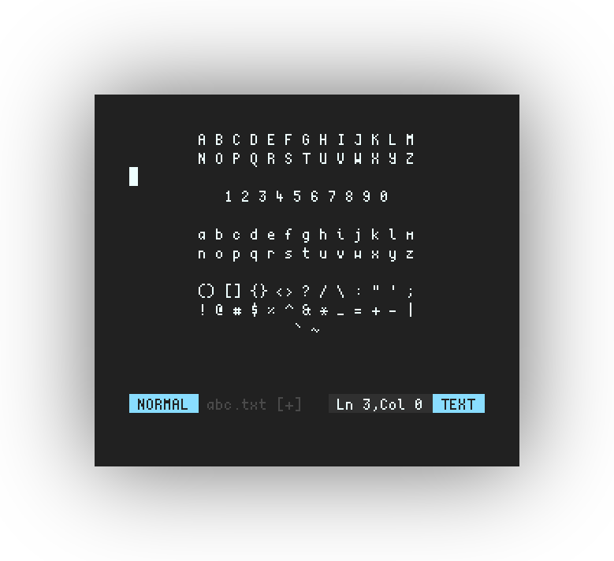
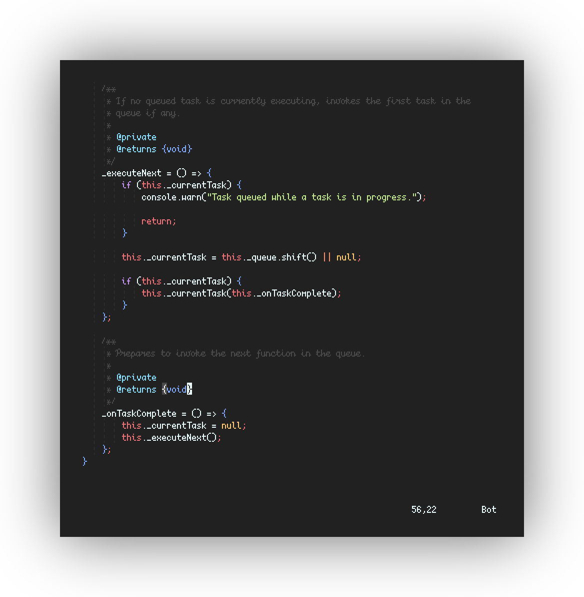
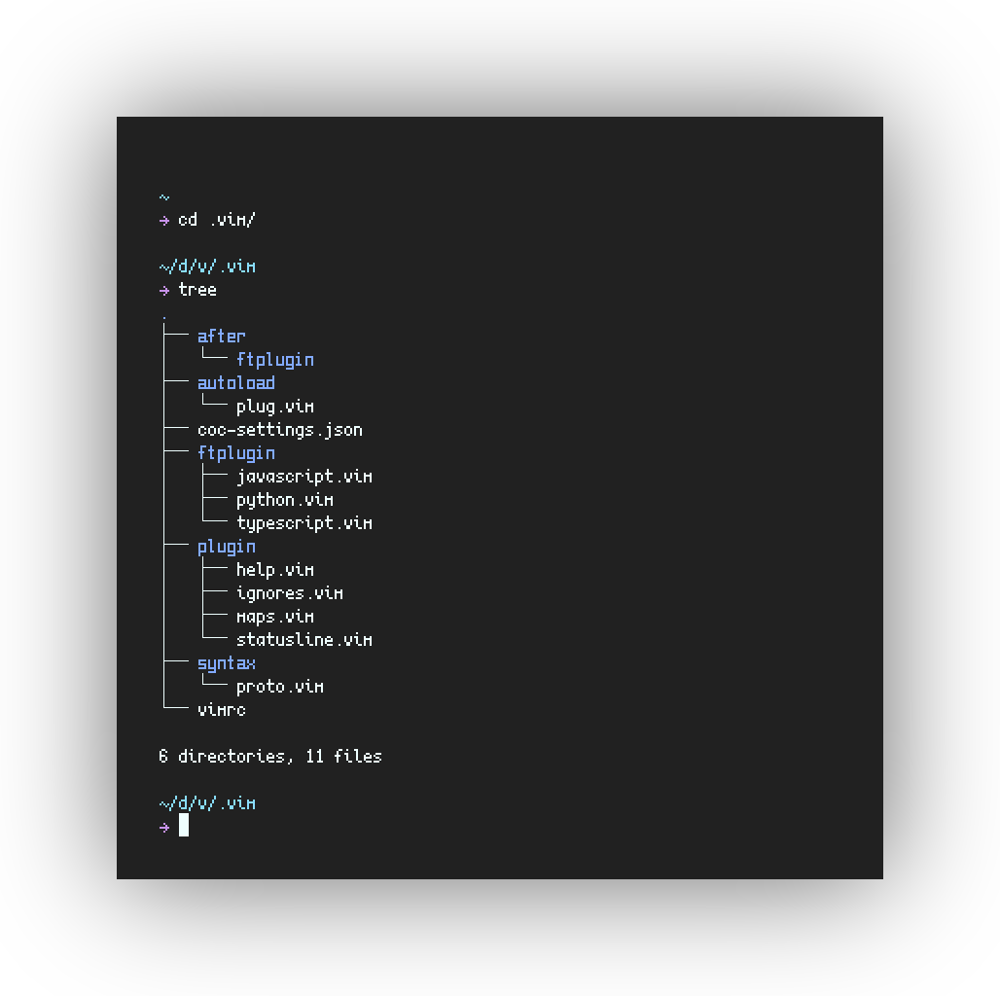
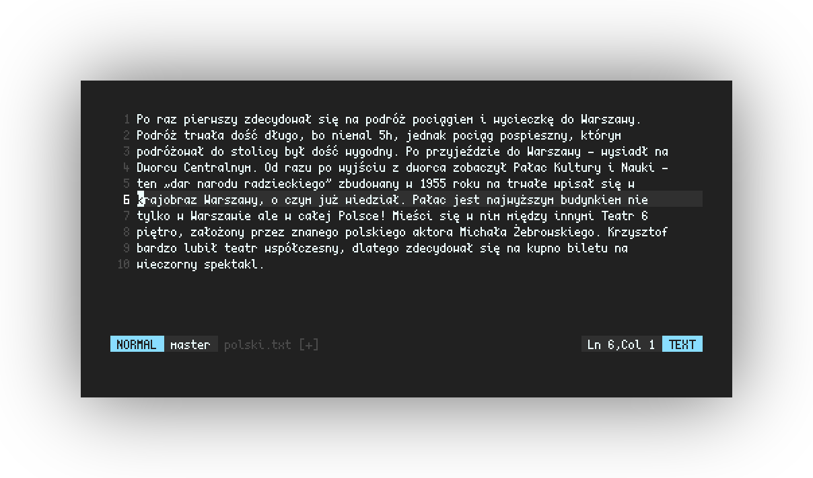
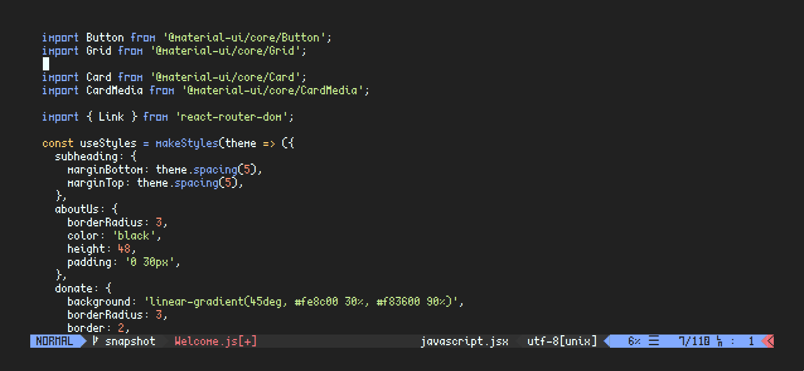

  

# scientifica

> Tall and condensed bitmap font for geeks.

`scientifica` is largely based on
[`creep`](https://github.com/romeovs/creep), with a number of
minor tweaks to improve readability (*a matter of taste of
course*). Most characters are just 4px wide, which is brilliant for
low dpi(90-120) displays.

## What's new?

 - Scaleable `ttf` format
 - Raster formats: `otb` and `bdf`
 - Ligatures (vim and neovim only)
 - **Bold** and *Italic* variants
 - New Characters to the following unicode blocks:
   * Geometric Shapes
   * Arrows
   * Miscellaneous Technical
   * Miscellaneous Symbols
   * Miscellaneous Mathematical Symbols-A
   * Private Use Area (Powerline symbols)
   * Mathematical Operators
   * Box Drawings
 - Revamped characters: `V, *, f, W, M, ~, & , i, t, a, (), [], {}`
 - Vertically centered operators
 - Larger Brackets to ease recognizability in streams of text

## Gallery

|   |   |           |
| -------------------------------- | -------------------------------- | --------------------------------         |
| Programming                      | Box Drawings                     | Latin, Polish, Slovakian, French, German |

|   |           |
| -------------------------------- | --------------------------------         |
| Powerline Glyphs                 | Ligatures (Rust, Python, Haskell, Ocaml) |

## Installation

Installation instructions have been moved to
[`INSTALL.md`](INSTALL.md).

## Ligatures

Scientifica supports ligatures in Vim and Neovim via the
conceal feature. Please read the
[Ligatures](ligature_plugins/README.md)
manual for instructions.

## Credits

Most Basic Latin characters are from
[creep](https://github.com/romeovs/creep) by
[romeovs](https://github.com/romeovs/).  
Creep has been optimized for linux terminals by
[raymond-w-ko](https://github.com/raymond-w-ko/). Check out
his version [here](https://github.com/raymond-w-ko/creep2).  
Some characters are based on
[Lemon](http://artwizaleczapka.sourceforge.net/).  
Thanks to the creators of [Font
Forge](https://fontforge.github.io/en-US/) for, well,
creating fontforge.  
